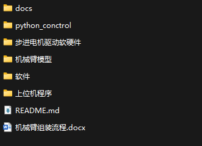
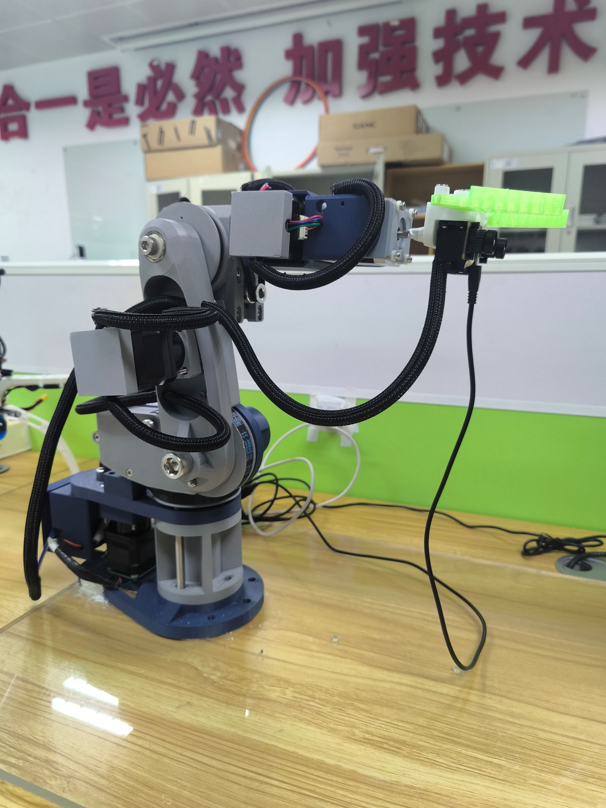

 # 基础3D打印6轴机械臂（python控制）

<h1 align="center">基础版本</h1>

## 简介

 

### 该仓库主要存放的是整个机械臂的3D打印文件、机械臂的组装过程、驱动板的软固件以及python打包的exe文件，用于让大家可以快速上手，快速搭建自己的机械臂并且驱动。

> [!IMPORTANT]
>
> 🔆 该项目也在持续的更新阶段，如果您有任何关于新的模型方法、研究、技术或发现运行错误的建议，请随时编辑并提交 PR。⭐ 如果您发现这个Github Project有用，请给它点个星！🤩🤩

### 所有文件
由于GitHub不支持上传大文件，需要前往[百度网盘](https://pan.baidu.com/s/1n5H7_Fa9LboSk5O9_eP8Pw?pwd=uccg)下载

 

### 注意事项
- 该仓库不包含上位机的源码，想要全部源码的可以在[工房](https://gf.bilibili.com/item/detail/1110221124?noTitleBar=1&from=mall-up_itemDetail&msource=comments_486049784&track_id=na_486049784_BV1oSDzYzEd7_A)获取
- 具体组装跟控制流程，请详细阅读[机械臂组装流程.docx](./机械臂组装流程.docx)

## 演示

具体演示查看[bilbil](https://www.bilibili.com/video/BV1oSDzYzEd7/?spm_id_from=333.999.0.0)

 

